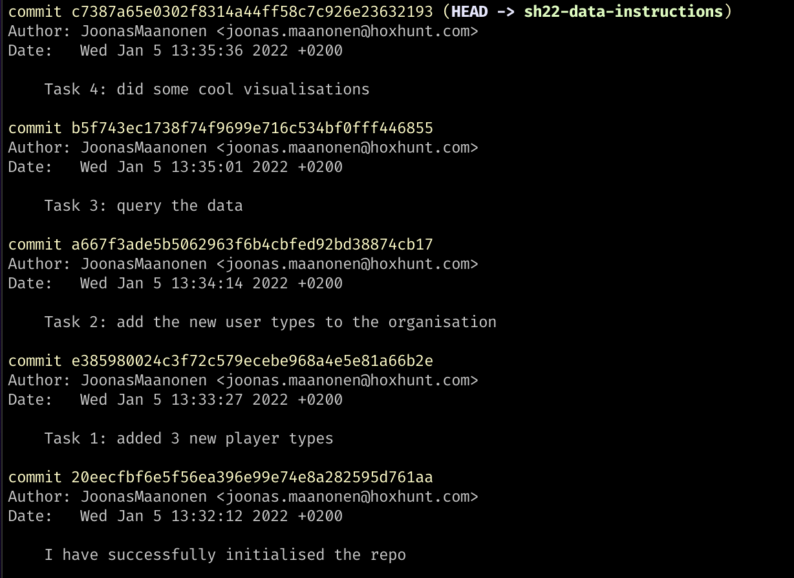

#  Summer Hunter 2022 Data Science Homework 

## Expected time expenditure for the assignment

- 4-5 hours of independent work
- possible homework debriefing and interview session with Hoxhunt employees, approximately 1-2 hours
- Assignment should be returned within 7 days of receiving it

## Get started 

### Setting up git:

- If you have not installed git to your machine, you can find the instructions how to do it [here](https://git-scm.com/book/en/v2/Getting-Started-Installing-Git)
- Clone this repository to your machine (use the green `code` button on this page)
- Open the repository on the command line of your machine and remove the `.git` folder by running the command `rm -rf .git`
- In github create a new repository and then follow the `…or create a new repository on the command line` instructions with a few tweaks (only following commands are necessary):
  ```sh
  git init
  git add .
  git commit -m "I have successfully initialised the repo"
  git branch -M main
  git remote add origin <REPLACE_WITH_THE_ADDRESS_GITHUB_GIVES_YOU>
  git push -u origin main
  ```
- Your own repository should now be initialised with the content from this repository

### Coding setup:

- The homework has been tested on `python 3.8 ` we suggest using the same python version to avoid any unforeseen bugs
- Ensure you are in the root of the repository when running any code
- Install the required python packages by running `pip install -r requirements.py`

## Running the code

### Data pipeline:

- `python main.py`

### Data visualization:

- `jupyter lab`

## Assignment 

### Goal of the assignment

As the Hoxhunt summer hunter program is an entry level track, we are not expecting candidates to have vast amount of experience. Rather, we are looking for motivated applicants that are eager to learn and develop as data scientists. However, there are some skills that will help you succeed as a data scientist at Hoxhunt:

- Python programming skills
- Data Science skills, such as data analysis, data visualisation and SQL
- Ability to learn new concepts and technologies quickly
- Ability to communicate in clear English
- Basic use of git

Thus the goal of the assignment is for us to learn about your capabilities and potential in these areas.

### Assessment of the assignment

As Python is the main tool used in the data team, we expect some level of proficiency in the language. Especially, we are interested that the code you write solves the problem at hand but is also readable <sup>[1](#pep8)</sup>. Data scientists at Hoxhunt are required to conduct various analysis tasks on a regular basis. These tasks are often carried out (at least partially) using SQL, which is the reason one of your tasks is to write a SQL query.

An important quality of a data scientist is to be able to draw conclusions from data and communicate these results to the relevant stakeholders in clear English. Furthermore, a picture is often worth more than a thousand words, hence we like to use visualisations as a mean of communicating our results. As a result, your ability to visualise data and draw conclusions from it is one of the things we look for in the final part of the assignment. Finally, as Hoxhunt is a product centric IT company, our daily work involves using version control with git. For that reason, your usage of git will also be evaluated.

The assignment contains production grade code that could be found in any of the data team's products. Therefore it might contain libraries, functionalities or practices that are new to you. This is anticipated and we do not expect you to know it all when applying to a junior level internship. What we do expect is you to have the capability to learn new concepts and methods when encountering them. Feel free to use your favorite search engine when facing any unknowns, after all that is what we do in our daily work. We hope you enjoy the assignment and do not hesitate to contact us should any questions arise! :)

## Context for the assignment

Hoxhunt provides automated security awareness training to its customers. In this training, the Hoxhunt platform sends simulated phishing attacks to the platform users that are typically employees of a customer company. The employees are able to report these emails with a designated Hoxhunt button found in their email client. The goal of the training is to educate employees in recognizing phishing attacks, so that they do not compromise themselves or their employers when encountering a real attack.

If a user reports a simulated phishing attack with the Hoxhunt button, they receive points in the Hoxhunt training. However, if they click a link found in the email, they are considered to have failed the simulation and are shown additional training material. For a demo on how the Hoxhunt platform works, please see the [Hoxhunt Product Demo](https://demo.hoxhunt.com/).

Important definitions in the context of this assignment are the three possible actions that a user can opt to after receiving a simulation. The actions are defined as such:

|   Action    |                                                                                                     Explanation                                                                                                     |
| :---------: | :-----------------------------------------------------------------------------------------------------------------------------------------------------------------------------------------------------------------: |
| **Success** |                                              After receiving a simulated phishing email, the user clicks the Hoxhunt button in their email client to report the email.                                              |
|  **Fail**   |                                 After receiving a simulated phishing email, the user clicks a link in the email or performs some other undesired action that is regarded as a fail.                                 |
|  **Miss**   | After receiving a simulated phishing the user ignores the email. After **n** days the Hoxhunt training considers that the user has missed reporting the simulation, and receives no points in the Hoxhunt training. |

## The assignment instructions

In the homework assignment your task is to simulate the behaviour of different user types in the Hoxhunt training. After simulating the behaviour of users, you need to conduct a small data analysis and visualisation on the data that was generated. Most of the code is given to you and you only need to implement four distinct features. The sections that you need to implement are marked with `# TODO(Task #)` comments. You are allowed to make changes to the existing code, either to implement or to remove features. If you do notable changes, please highlight them in your deliverable.

The assignment consists of the following subtasks:

**Task 1**: Create two or more different user types to the Hoxhunt training. [See the following file](user.py)

**Task 2**: Add the different user types to a hypothetical organization. [See the following file](organization.py)

**Task 3**: Write one or several SQL queries to find things of interest from the database. [See the following file](main.py)

**Task 4**: Run main.py and you should receive a csv file with some data. Visualise the data using visualisations of your choice with the template notebook provided in [here](visualization.ipynb).

**Tip:** The three possible actions described earlier allows for the creation of countless of various user behaviour. Try to imagine what type of users could exist in reality and guesstimate their distribution in your hypothetical organization. Finally, what can you show us to tell the story of _your_ unique organization?

## The deliverable

Your assignment should be found in a Github repository that contains your solution to the assignment. If you leave your repository public then you only have to return a link to the repository. If you wish to make your repository private, in addition to returning the link to the repository you have to give read access the following GitHub accounts: @joonasmaanonen, @markustoivonen, @MEstlander and @robinstaudinger. To give read access, navigate to the _Settings_ tab of your repository and find the _Collaborators_ section.

Each commit in your repository should represent one of the subtasks or a functional entity of the assignment. The image below shows an example of a possible commit history. It is completely fine to edit a section of code that has been committed previously. The purpose of separating the assignment into multiple commits is for us to see that you can use git on a basic level, and that we can follow your thought and working process.

<p align="center">
  
</p>

## What happens next? 

After returning the assignment, we proceed to assess the deliverable internally. If the assignment is deemed satisfactory, we shall invite you for a subsequent debrief interview with members from the Hoxhunt data team, to whom you will be able to present your work and discuss it with.

---

<a name="pep8">[1]</a> : For tips on how to write readable code, you can refer to the [PEP8](https://www.python.org/dev/peps/pep-0008/) style guide.
